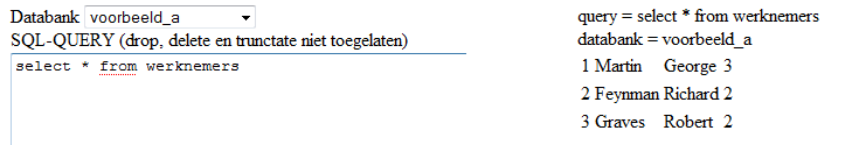

# Les 5 PDO

## PDO oefening 1
Maak de toepassing die getoond wordt in onderstaande figuur.  

De toepassing bestaat uit ingave.php en verwerking.php. 
In ingave.php worden alle databanken opgehaald uit de MySQL-server. 
De databanken worden in een drop-down menu geplaatst. 
Ook kan via een textarea een SQL-query uitgevoerd worden. 
Via verwerking.php wordt de query uitgevoerd op voorwaarde dat er geen drop, delete of truncate in staat. 
Het resultaat wordt ook getoond.

Hints:
* De SQL query  SHOW DATABASES kan gebruikt worden om de namen van alle databanken te vinden.
* De controle of drop, delete, truncate in de SQL-query staat kan via de functie stristr:
  http://php.net/manual/en/function.stristr.php

## PDO oefening 2
Maak een databank met daarin de tabel gebruikers.  Elke gebruiker heeft id en naam.

Maak een PHP-toepassing waarmee je een overzicht van de gebruikers krijgt (overzicht.php).  Ook worden de volgende acties ondersteund: gebruikers kunnen verwijderd worden (verwijder.php), gebruikers kunnen aangepast worden (wijzig.php) en gebruikers kunnen aangemaakt worden (toevoegen.php).

### Extra
Zorg ervoor dat in oefening2 bij het verwijderen bevestiging gevraagd wordt (bevestig.php).  Je kan gebruik maken van hidden input om gegevens te bewaren.
